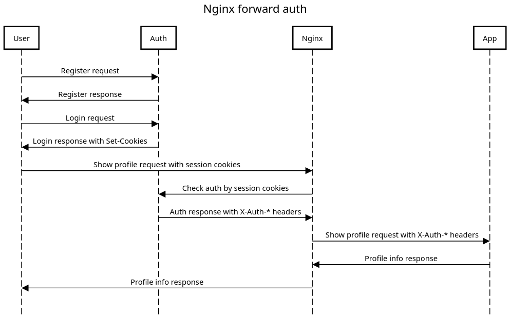

Enable ingress addon:
```bash
minikube addons  enable ingress
```

Install auth-service:
```bash
helm install auth ./auth
```

Install app-service:
```bash
helm isntall app ./app
```

Run newman tests for postman-collection:
```
newman run forward-auth.postman_collection.json
```
